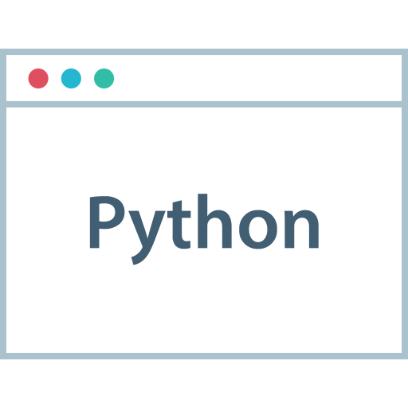
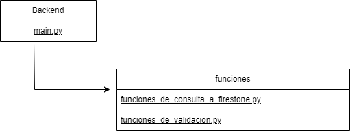
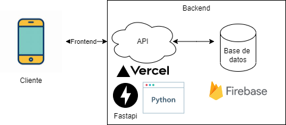

- 💬 Backend
- 📫 
- 😄 Paredes Brian
- ⚡ [Perfil LinkedIn](https://www.linkedin.com/in/brian-alexis-paredes-/)

 <h1></h1>
 

**⌨️🖱️LANGUAGES AND 🔧TOOLS:**  

<code></code>
<code></code>
<code></code>
<code></code>

<h1></h1>

 <h1></h1>
 

**📁DIRECTORIO DE ARCHIVOS 📂**  

<h1></h1>

 <h1></h1>
 

**ORQUESTACION 👔**  

<h1></h1>